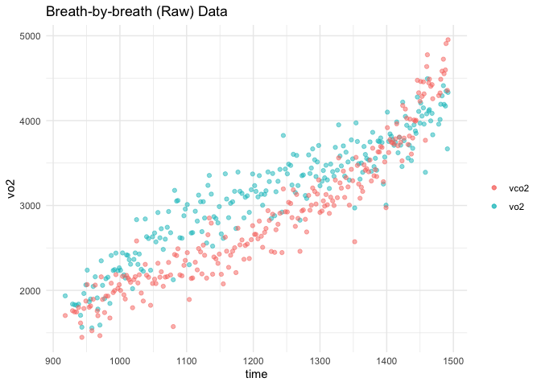
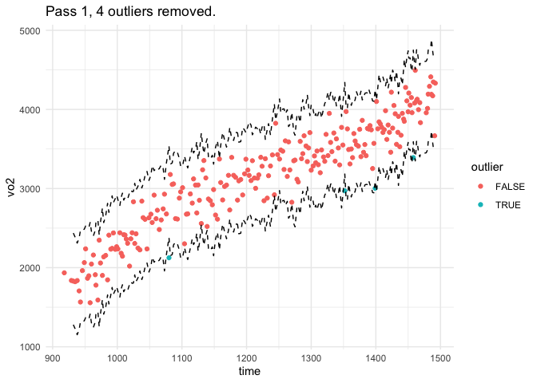
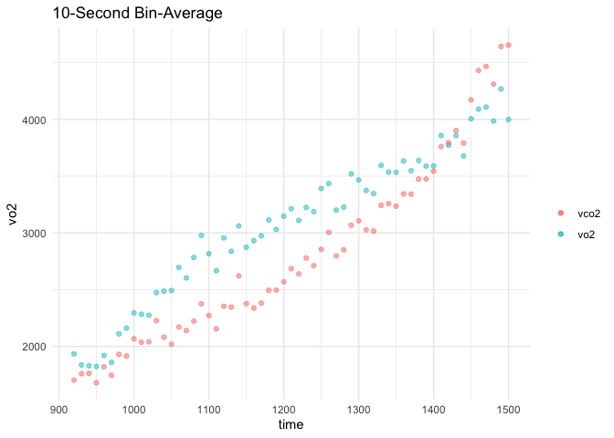
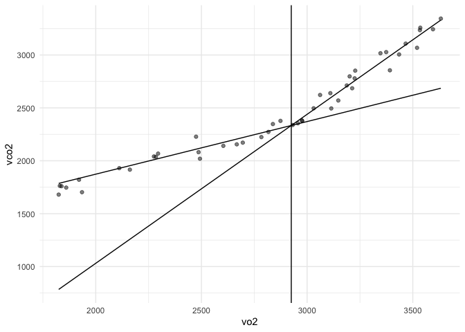
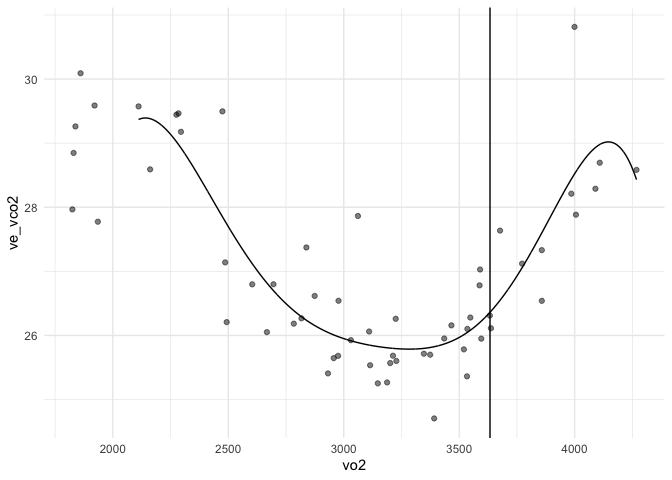

<!-- README.md is generated from README.Rmd. Please edit that file -->

# gasExchangeR

<!-- badges: start -->
<!-- badges: end -->

The goal of gasExchangeR is to help exercise physiologist more easily
analyze gas exchange data and to provide more directly control when
doing so. The overview of the process of analyzing gas exchange data
involves importing the data, identifying and removing outliers,
interpolating if desired, and finally averaging the data. Afterwards
then one can determine ventilatory thresholds, VO2max, and other
important values.

## Installation

You can (hopefully) install this package from CRAN. If that doesn’t
work, you can install the development version of gasExchangeR from
[GitHub](https://github.com/) with:

``` r
# install.packages("devtools")
devtools::install_github("ahesse2567/gasExchangeR")
```

## Development notes

The gasExchangeR package is part of [Anton
Hesse’s](https://orcid.org/0000-0001-8456-7343) PhD dissertation at the
University of Minnesota-Twin Cities. Please expect changes and
improvements if you use this package, and please submit feedback if you
encounter bugs or have suggestions.

## Early acknowledgemets and other recommended packages

This package expands on the work by Felipe Mattioni Maturana
(<https://orcid.org/0000-0002-4221-6104>). Specifically, his work on the
[whippr](https://github.com/fmmattioni/whippr) and
[lacater](https://fmmattioni.github.io/lactater/) packages.
[gasExchangeR](https://github.com/ahesse2567/gasExchangeR) focuses more
on graded exercise testing than VO2 kinetics; it also emphasizes
ventilatory breakpoint algorithms.

## Using this package to find ventilatory thresholds

Many exercise studies require finding the first and second ventilatory
thresholds (VT1 & VT2). However, breath-by-breath data is highly
variable and requires some cleaning prior to finding these thresholds.

``` r
# Load libraries
library(gasExchangeR)
library(tidyverse)
library(janitor)
```

### Data Processing

``` r
# read in raw data
file_lines <- readLines("inst/extdata/Anton_vo2max.txt")
df_raw <- read.table(textConnection(file_lines[-2]), header = TRUE, sep="\t")

# initial data tidying
df_unavg <- df_raw %>%
    as_tibble() %>%
    clean_names() %>%
    separate(`time`, into = c("m1", "s1"), sep = ":") %>%
    separate(ex_time, into = c("m2", "s2"), sep = ":") %>%
    separate(time_clock,
             into = c("h3", "m3", "s3"),
             sep = ":") %>%
    mutate(across(where(is.character), as.numeric)) %>%
    mutate(time = (m1*60 + s1), .keep = "unused") %>%
    mutate(ex_time = (m2*60 + s2 ), .keep = "unused") %>%
    mutate(clock_time = hms::hms(s3, m3, h3), .keep = "unused") %>%
    relocate(contains("time")) %>%
    filter(!is.na(ex_time)) %>%
    filter(speed >= 4.5 & ex_time >= 750) %>%
    select(-time) %>%
    rename(time = ex_time,
           vo2_kg = vo2,
           vo2 = vo2_1,
           ve = ve_btps) %>%
    # calculate common variables
    mutate(ve_vo2 = ve / vo2 * 1000, 
           ve_vco2 = ve/vco2*1000,
           excess_co2 = vco2^2 / vo2 - vco2)
```

Plotting the raw data

``` r
ggplot(data = df_unavg, aes(x = time)) +
  geom_point(aes(y = vo2, color = "vo2"), alpha = 0.5) +
  geom_point(aes(y = vco2, color = "vco2"), alpha = 0.5) +
  scale_color_manual(values = c("vo2" = "red", "vco2" = "blue")) +
  theme_minimal() +
  ggtitle("Breath-by-breath (Raw) Data") +
  scale_color_discrete(name = "", labels = c("vo2" = "vo2", "vco2" = "vco2"))
#> Scale for colour is already present.
#> Adding another scale for colour, which will replace the existing scale.
```



The raw data is obviously noisy. We will first use a rolling-breath
average with absolute VO2 values to remove outliers.

``` r
df_unavg_no_outliers <- df_unavg %>% 
    ventilatory_outliers(outlier_cols = "vo2", max_passes = 1,
                         plot_outliers = TRUE)
```



    #> 4 outliers removed at indicies 62, 170, 193, 225

Removing outliers helps, but some averaging is also required.

``` r
df_avg <- df_unavg_no_outliers %>% 
    avg_exercise_test(method = "time", calc_type = "bin", bin_w = 10)

ggplot(data = df_avg, aes(x = time)) +
  geom_point(aes(y = vo2, color = "vo2"), alpha = 0.5) +
  geom_point(aes(y = vco2, color = "vco2"), alpha = 0.5) +
  scale_color_manual(values = c("vo2" = "red", "vco2" = "blue")) +
  theme_minimal() +
  ggtitle("10-Second Bin-Average") +
  scale_color_discrete(name = "", labels = c("vo2" = "vo2", "vco2" = "vco2"))
#> Scale for colour is already present.
#> Adding another scale for colour, which will replace the existing scale.
```

 \###
Finding Ventilatory Thresholds

``` r
bp_dat <- breakpoint(.data = df_avg, method = "v-slope",
                     algorithm_vt2 = "d2_reg_spline_maxima",
                     x_vt2 = "vo2", y_vt2 = "ve_vco2",
                     vo2 = "vo2", vco2 = "vco2", ve = "ve", time = "time",
                     bp = "both", truncate = TRUE, 
                     front_trim_vt1 = 60, front_trim_vt2 = 60,
                     pos_change_vt1 = TRUE, pos_change_vt2 = TRUE,
                     pos_slope_after_bp = TRUE)
print(bp_dat$bp_dat, width = Inf)
#> # A tibble: 2 × 28
#>   bp    algorithm            x_var y_var   determinant_bp est_ci  
#>   <chr> <chr>                <chr> <chr>   <lgl>          <chr>   
#> 1 vt1   v-slope              vo2   vco2    TRUE           estimate
#> 2 vt2   d2_reg_spline_maxima vo2   ve_vco2 TRUE           estimate
#>   pct_slope_change f_stat   p_val_f  time clock_time speed grade vo2_kg   vo2
#>              <dbl>  <dbl>     <dbl> <dbl>      <dbl> <dbl> <dbl>  <dbl> <dbl>
#> 1             183.   51.4  3.81e-11 1149.     42616.  6.83   1.1   37.6 2925.
#> 2              NA    NA   NA        1360.     42827.  9.06   1.1   46.3 3633.
#>    vco2   rer    rr vt_btps    ve    br peto2 petco2    hr   hrr ve_vo2 ve_vco2
#>   <dbl> <dbl> <dbl>   <dbl> <dbl> <dbl> <dbl>  <dbl> <dbl> <dbl>  <dbl>   <dbl>
#> 1 2334. 0.800  21.8   2777.  60.3  66.0  92.0   41.3  157. 18.5    20.5    25.6
#> 2 3346. 0.928  28.5   3095.  87.8  50.6  98.4   40.6  179.  6.65   24.3    26.4
#>   excess_co2
#>        <dbl>
#> 1      -469.
#> 2      -246.
bp_dat$vt1_dat$bp_plot
```



``` r
bp_dat$vt2_dat$bp_plot
```


